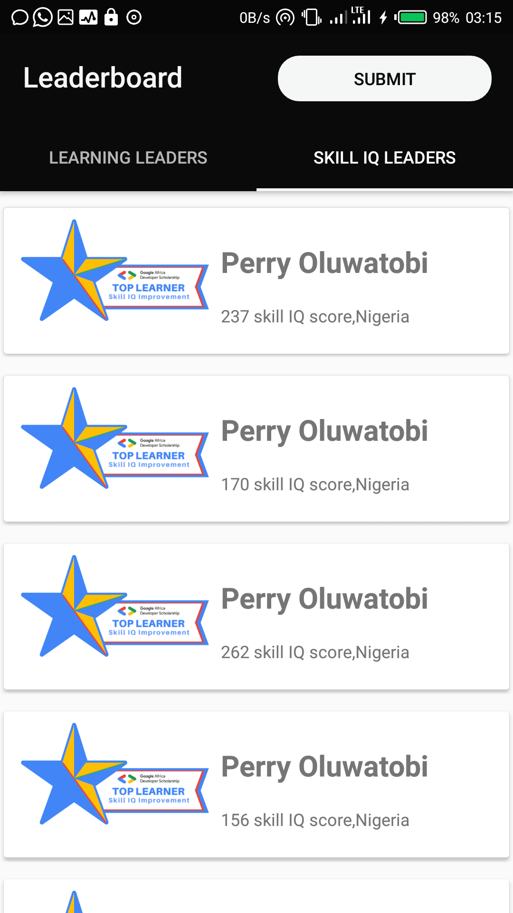
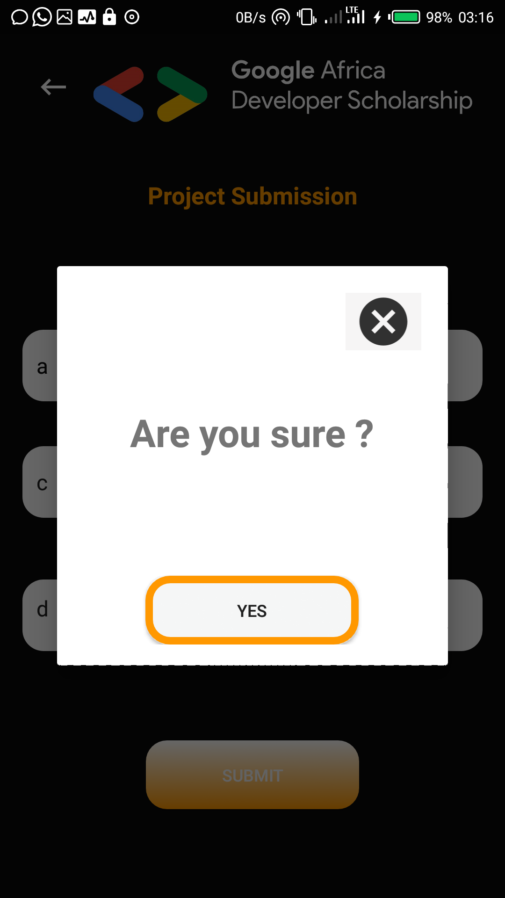
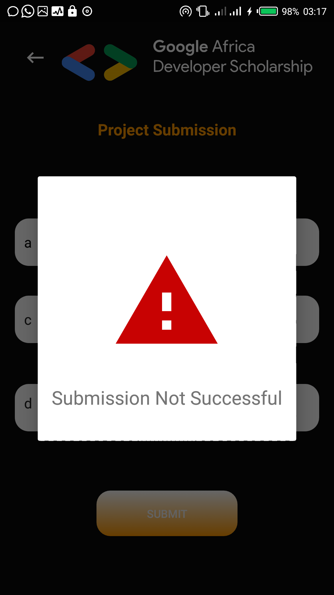

# Leaderboard

This a simple app that uses recycler view to display information gotten
from a web service via Retrofit. It is shown in a tabbed layout of
fragments, below shows each activity/fragments in the application

